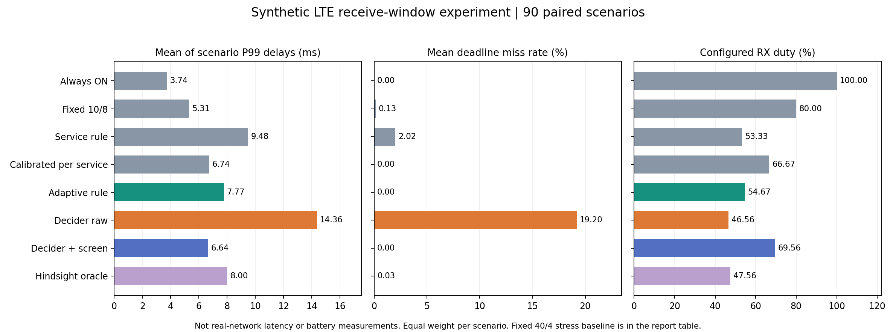

# Jev-class RRC configuration experiment

用 [Mapika/Decider](https://github.com/Mapika/decider) 的真实 2B 权重实现类型化 RRC 参数选择，接入 [EEzim/RRC](https://huggingface.co/datasets/EEzim/RRC) 与 [nrRRC_Simulator](https://github.com/EE-zim/nrRRC_Simulator) 的协议解析，并进行可复现的紧时延业务对照实验。

**当前结论：技术链路已跑通，领域微调改善了 Decider 原始选择，但仍未证明优于强传统基线。** 原 DRX 业务效果来自明确假设下的合成分组队列，不是真实无线网络测量，也不是闭源 Jev 的测试结果。

📄 **[新增系统验证：ns-3 LTE/EPC 的 RRC A3 切换配置与逐包指标](docs/ns3_lte_system_validation.md)**。共 1415 次完整协议栈仿真，含新几何外推、Qwen 对照和 A3 专用 LoRA；已测场景中传统规则优于原版及适配版 Decider。A3 切换与下方 DRX 优化是两个不同问题，结果不可混用。

📄 **[新版中文报告：Qwen 对照、温度和微调](docs/report_v2.md)** · [完整样例](docs/example_v2.md) · [逐条推理和仿真时间](artifacts/temperature/per_scenario_timing.csv) · [第一版报告](docs/report.md) · [复现步骤](docs/reproduce.md)

## 实测结果

90 个测试场景：工业周期控制 5 ms、交互式 XR 10 ms、交互游戏 20 ms，各 30 个。约束是每场景超时包不超过 1%；目标是在约束下降低配置接收占空比。

| 方法 | 超标场景 | 平均接收占空比 | 场景 P99 均值 |
|---|---:|---:|---:|
| Decider 原始选择 | 36/90 | 46.56% | 14.363 ms |
| Qwen3.5-2B-Base 原始生成 | 48/90 | 33.67% | 90.727 ms |
| Decider 领域 LoRA 原始选择 | 10/90 | 57.78% | 7.358 ms |
| Decider + 候选筛选 | 0/90 | 69.56% | 6.639 ms |
| Decider 领域 LoRA + 候选筛选 | 0/90 | 66.89% | 6.564 ms |
| 确定性自适应规则 | 0/90 | 54.67% | 7.773 ms |
| 校准集按业务选固定配置 | 0/90 | 66.67% | 6.743 ms |

占空比是配置代理，不能解释为实测能耗。P99 列是各场景 P99 的平均值，不是全体包的 P99。筛选后模型更低的时延伴随更高占空比，不构成原定目标下优于规则的证据。报告包含全部基线、置信区间、事后最优参考和三类固定选取的具体用例。

RTX 3070 8 GB 上，原始 Decider 90 次配置决策的中位耗时 **186.24 ms**、Qwen 自回归生成 **1188.50 ms**。每条场景只决策一次，模拟 1000 ms 分组到达，九种配置的本机 CPU 仿真墙钟中位耗时 **2.56 ms**。因此本原型适于业务开始前选配置，不能用于 5 ms 的逐包控制环。



## 已实现

- 真实 Decider 2B v11 下载、完整 SHA256 校验及 Choice/Noul/Score 功能测试。
- 全量公开 RRC 示例审计；上游解析器的 37 条消息 → 16 对 QA；仅白名单 MAC 参数进入模型/配置片段。
- 九种合法 LTE 长 DRX 周期/on-duration 组合、合成 FIFO 分组评估器、传统基线和模型消融。
- 校准/测试分离；模型不可见未来流量、结果或最优标签；逐请求概率/耗时和逐场景结果保留。
- Qwen3.5-2B-Base 真实权重和 90 条生成式对照、Decider Choice 温度校准与 300 条合成场景 LoRA 微调，以及全新 90 场景确认集。
- 本地测试、158 项相关上游单元测试；第一版 810 个“场景 × 配置”的 CPU 独立重算核验与新版逐条结果核验。

## 最小复核

已安装 NumPy 的 Python 可直接复核公开结果，无需下载模型或使用 GPU：

```bash
python -m unittest discover -s tests -v
python scripts/verify_evidence.py
python scripts/verify_v2.py
```

完整安装、下载与真实推理请按[复现说明](docs/reproduce.md)。上游代码在 `external/`，权重在 `models/`，原始数据在 `data/rrc/`；三者均不随此仓库分发。

## 证据边界

公开 HF 数据实际仅 16 行，没有 DRX 或配置干预标签；不能用它复现参考论文的私有训练集。上游仓库的随机时延占位值未被采信；未启动 Linux/srsRAN 无线栈。领域微调只使用合成标签，工作负载未经真实应用数据校准。完整 NR、Active Time、HARQ、多用户及配置生效成本仍需另行验证；[下一阶段系统验证方案](docs/next_validation.md)列出具体门槛。

本项目保留失败与负面结果，不把弱固定配置造成的过载改善包装成 AI 相对传统优化器的增益。

原创代码、报告与聚合结果采用 [Apache 2.0](LICENSE)；外部资源的许可与归属见 [NOTICE](NOTICE.md)。
