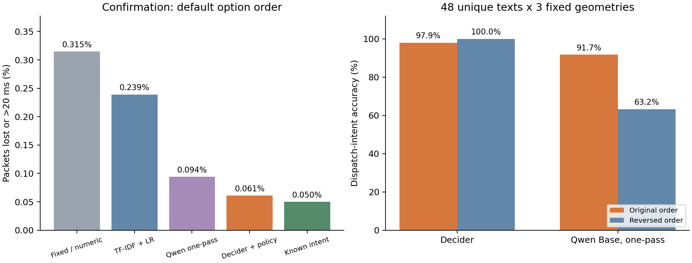
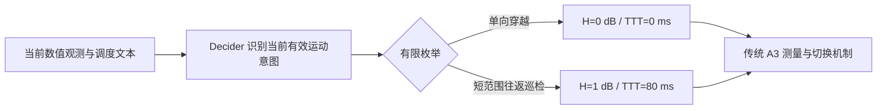

# 为什么直接配置没有增益，以及 Decider 最值得验证的 RRC 用例

实验日期：2026-10-08。本文延续[此前的 ns-3 LTE A3 验证](ns3_lte_system_validation.md)，新增 **210 次协议栈仿真、1794 次记录完整输入的模型请求**。测试对象是开源 Decider 2B v11，不是闭源 Jev。全部新增工件见 [semantic_uc](../artifacts/semantic_uc/)，汇总见 [summary.json](../artifacts/semantic_uc/summary.json)。

记号：H 为 A3 迟滞裕量，单位 dB；TTT 为条件持续满足后才触发的等待时间，单位 ms。例如 H2/T160 表示 2 dB / 160 ms。

## 结论及其边界

旧结果不能简单解释成“少喂了一些无线数据”。在旧 A3 实验里，模型已经知道完整未来轨迹；真正复现出来的问题是：**原输入存在表述干扰，但修正表述仍无法让模型学会配置关系；小规模微调对选项顺序敏感；而强传统规则已经几乎用尽该简化环境的优化空间。** 领域知识是否存在于模型内部，不能通过一次输出失败直接断言。

最有希望的方向是 **业务语义驱动的慢时标 RRC 策略选择**：先识别 AGV 当前有效调度指令描述的是“单向穿越”还是“边界附近往返巡检”，再由独立校准的确定性策略选择 A3 参数。在冻结的第二组语义确认集上，默认选项顺序的 Decider 流水线把超时或丢包比例从数值信息基线的 **0.3146% 降至 0.0610%（相对下降 80.6%）**；相同文本信息的 TF-IDF + 逻辑回归为 **0.2391%（相对下降 74.5%）**。

这验证了该合成用例中“理解非结构化调度意图”的价值，**没有验证 Decider 比掌握同一结构化意图的传统控制器更会优化无线参数**。直接提供正确意图的确定性控制器达到 0.0500%，仍好于默认顺序下的 Decider。真实调度数据、复杂无线环境和部署系统尚未验证。



## 一、没有增益的原因：逐项干预，而非猜测

### 1. 输入截断与单纯的选项位置偏好不是原版的主要原因

沿用旧核心 12 场景，分别循环移动五个配置选项，使每个配置都出现过每一个位置。原版在原始输入的 **60/60 次请求中仍选择 H2/T160**。因此，“总点第三个位置”不能解释原版恒定输出；它偏好的是这个配置的内容，至少在所测循环排列中如此。未测试所有 120 种排列。

这些输入为 142～231 个 context tokens，远低于当前 API 的 1536-token 上限，未发生上下文截断。检查了本地实际导入的 `external/decider`、plain prompt 布局和固定权重。上游 API 对提供的顺序不随机打乱，选项标签头只输出合法候选。完整证据见 [diagnose_base.json](../artifacts/semantic_uc/diagnose_base.json)。

| 干预 | 原版结果 | 能说明什么 |
|---|---|---|
| 原描述 × 五种循环顺序 | 60/60 选 H2/T160 | 所测范围内不是纯位置偏好 |
| 增加运动类别、摆幅/站距等派生特征 | 52 次 H2/T160、8 次 H1/T80 | 表达影响输出，但没有形成可靠的参数选择 |
| 在 state 中明确给出此前校准的条件规则 | 60/60 选 H1/T80 | 领域提示改变了先验，未可靠执行条件分支 |
| 去掉共同定义，仅保留当前场景 JSON | 路线识别 24/24 正确；参数仍 12/12 选 H2/T160 | 能读取路线，不等于知道该路线下的无线代价 |
| 加入明确的当前运动句子及规则 | 路线识别 24/24 正确；参数仍 12/12 选 H1/T80 | 仅补知识文本和改变表达不足以修复直接配置 |

### 2. 确实存在输入表达问题，但它不是全部原因

旧 state 同时解释 “Cross means …” 和 “oscillate means …”，然后才在 JSON 中指明当前 trajectory。使用一致的问题“本会话 UE 将如何运动？”时，这种写法只有 **12/24** 次正确；删除共同定义、仅保留同样的当前场景 JSON 后是 **24/24**。两个数字都包含正反两种选项顺序。

这是可复现的表述干扰：信息原本存在，却没有被模型稳定提取。它不等于缺少输入字段。更重要的是，去掉干扰并没有改善直接 A3 选择。实验记录见 [representation.json](../artifacts/semantic_uc/representation.json)。此前 `route_control` 还使用了 AGV 调度问题与非 AGV 描述的不匹配组合，只作为早期诊断线索，不用它单独证明模型能力。

### 3. 更强证据指向“无线代价映射未掌握”，但不能区分所有内部原因

识别“穿越/往返”只需要理解状态；确定 H/TTT 则需要知道测量触发、切换延迟、乒乓切换和分组截止时间之间的环境特定关系。后一关系不能从合法 RRC 参数名称直接推出来。相同输入下，路线识别已正确，直接参数选择仍恒定，是两个子能力不匹配的证据。

补充校准规则后全部改选 H1，并不能证明“缺知识已经解决”：它没有执行“穿越选 H0，短范围往返选 H1”的条件。可能同时存在领域经验不足、数值条件处理弱、提示遵循能力不足和与优化目标不匹配的训练先验。未做探针或大规模受控再训练，不能进一步宣称某个内部机制已被唯一定位。

这与上游对 2B v11 的定位相容：它是单次前向决策模型，复杂判断宜拆分，对写在问题里的条件规则存在局限，且应在自己的业务上校准概率。作者的说明不是本实验的替代证据。参见 [Decider 模型卡](https://github.com/Mapika/decider/blob/main/MODEL_CARD.md#limitations)。

### 4. 旧微调改善了分布，但没有学稳条件关系

旧 A3 LoRA 训练集只有 32 个场景、两轮训练、梯度累积 4，即 **16 次优化器更新**；训练 208,896 个 q/v 投影适配参数，输出头冻结。标签是 18 个 H0 和 14 个 H1，不能归咎于严重类别不平衡。

本次换序实验中，适配模型在原顺序仍 12/12 选 H0；其余顺序分别多数改为 H1 或 H2，**12 个场景没有一个能在五种顺序下保持同一配置**。原始输入的全部 60 次结果为 H0 12 次、H1 39 次、H2 9 次。这与固定顺序训练造成的脆弱迁移相符，但尚未通过“只改变顺序增强”的再训练因果实验排除其他原因。

训练标签还有一个被准确率遮住的问题：32 个训练场景中，**14 个场景有四档配置在主要截止时间目标上并列最优，2 个场景有三档并列，只有 16 个场景唯一最优**。交叉熵却把其中一个配置当作唯一正确答案；而少量穿越场景选错配置的分组代价可能很大。验证 loss 从 2.089 降至 0.562，不能代替配置条件性、换序稳定性和端到端 KPI 验证。证据见 [诊断](../artifacts/semantic_uc/diagnose_adapter.json)与[原训练元数据](../artifacts/system_validation/a3_train_result.json)。

后续若训练直接配置模型，应使用随机选项排列、并列最优的软目标、按 regret/约束违约加权的目标和独立几何测试。需要比较足够多更新步数的学习曲线。本文没有把这些尚未执行的训练方案写成已验证改进；新 UC 的 Decider 完全使用原始权重。

### 5. 强基线和问题简化使“可提升空间”很小

重新计算了两个不同的事后上限：每个场景对所有种子固定选择同一配置的最优结果，与每个种子分别挑最优的结果。它们是诊断上限，均不能作为可部署策略。

| 旧测试集 | 几何规则的违约包数 | 场景描述固定决策的事后最优 | 每种子事后最优 |
|---|---:|---:|---:|
| 核心 holdout | 3131 | 3131 | 3131 |
| 第一组外推 | 4377 | 4377 | 4377 |
| 全新几何 | 10136 | 9887 | 9495 |

前两组规则已经达到所测候选内的上限。全新几何中，规则与每种子最优之间只有 641 包；其中 **392 包**来自同一描述跨种子无法共享同一最优配置的差异，剩余 **249 包**才是这种确定性描述决策还能改进的空间。后者仅占 1,725,000 个发送包的 **0.0144 个百分点**。这个小空间无法支撑“换成语言模型自然获得大收益”的期待。

表中采用几何规则 v2；它在第一组外推结果之后修订，因此前两行是事后空间诊断，不能追称独立盲测。规则 v2 的独立确认集是最后一行。上述上限也仅适用于这些已测种子与候选，不是任意真实无线环境的理论上限。

旧环境只有两站、单 UE、固定调度与传播设置，没有多 UE 竞争和随时间变化的遮挡。遗漏实时 RSRP/SINR、负载、队列和测量历史会限制真实系统，但不能用来解释这里的全部恒定输出：在这个受限仿真域里，现有输入已经足以让简单规则接近最优。

### 6. 不要把不同目标、不同实验混为一谈

旧 DRX 结果来自合成 FIFO 接收窗口模型；低时延伴随更高接收占空比，不能算原定“满足截止时间后降低占空比”目标上的增益。候选筛选也承担了大量约束满足工作。上述 A3 输入干预不是对 DRX 失败的同等因果验证。公开 RRC 消息主要提供协议结构，缺少充分的“业务状态—候选配置—无线 KPI”监督，不能直接充当优化训练集。

正温度缩放保持 Choice 的 argmax：`argmax(z/T)=argmax(z)`，所以调整温度本身不能修复这种确定性恒定选择。只有涉及概率阈值、拒答或采样的策略才可能改变动作，届时必须重新验证风险与 KPI。本次保持 checkpoint 的全局温度 1.145、Choice 实际温度 1.164。

## 二、最有希望的 UC：非结构化业务意图到受约束 RRC 策略

相比直接做低维数值寻优，更匹配 Decider 能力的是：**既有系统只有自由文本/异构调度说明，缺少稳定的结构化路线 API，而网络需要在业务开始前选定有限的已校准策略。** AGV 的任务修订、取消旧单、否定和其他车辆的干扰说明，可能影响它未来是在边界附近巡检，还是驶入相邻小区。

本实验采用以下分工：



Decider 没有生成任意参数，也不替代每个测量时刻的 A3 触发。两个策略的映射来自先前独立校准并在测试前冻结；文本模型只回答一个语义问题。此分工把环境知识放在可审计的控制器中。如果调度系统已经提供准确的结构化路线/意图，直接用传统控制器即可，模型没有新增信息优势。

这也是本 UC 的前提限制：巡检是已知的短范围、每 2 s 反向的任务原语，不是任意巡检轨迹。超过支持范围的摆幅、任务中途改道或不可信调度说明，需要重新评估策略；本文尚未实现通用 OOD 检测与在线重配置。

## 三、实验协议与公平性

### 数据和物理仿真

第一轮：训练 6 个成对表达族，共 12 条独立文本；开发 3 族、6 条；测试 10 族、20 条。每条文本配三种固定几何，因此为 36/18/60 条记录。按表达族切分，而非随机拆相近句子。

第二轮确认：在看到第一轮结果后，先冻结 **24 个全新成对表达族、48 条独立文本**，再推理。三种几何对应 **144 条记录**。传统分类器可以使用第一轮训练和测试的标签，合计 **32 条独立训练文本**；确认文本不进入训练。额外加入了根据第一轮错误增强的关键词规则，仍在确认推理前冻结。确认集含任务替换、条件/反事实、否定及其他 AGV 的干扰，是合成挑战集，不代表真实调度文本的频率分布。

两轮均由本研究手工编写英语模板并确定语义标签，没有真实工业文本或独立盲标员。英语与所测 checkpoint 的主要支持范围一致；中文能力未测试。完整数据见 [首轮冻结集](../artifacts/semantic_uc/frozen_dataset.json)和[确认冻结集](../artifacts/semantic_uc/confirmation_dataset.json)。

数值状态相同的一对文本分别控制两种真实 ns-3 轨迹：

| 固定几何 | 两 eNB 间距 | 初始速度 | 初始 x | 巡检反向周期 |
|---|---:|---:|---:|---:|
| g0 | 250 m | +6 m/s | −6 m | 2 s |
| g1 | 300 m | +8 m/s | −8 m | 2 s |
| g2 | 375 m | +9 m/s | −9 m | 2 s |

共 6 种物理场景，每种均测试 H/TTT = `(0,0),(1,80),(2,160),(3,256),(6,320)`。校准 RNG runs 91–92：60 次仿真；独立评估 runs 101–105：150 次。两轮文本复用这组物理结果，并未因改写文本再产生新网络实验。校准仅决定固定基线；语义到配置映射从先前实验冻结，没有用当前测试结果寻优。

仿真为 ns-3 3.46 LTE/EPC/X2，非理想 RRC 信令，使用此前未改动的 C++ 源文件。重新编译的二进制与实际运行的缓存二进制 SHA256 完全一致。**它是 LTE A3 软件系统仿真，不是 NR DRX、射频实测或实际 AGV 验证。**

### 每条测试记录的时序

- 模型在业务开始前决策一次，24 s 的 session 中不再推理；可等效描述为每 episode 一次，不能理解为 1 kHz 分组级推理。
- ns-3 运行到 24.1 s；UDP 在 1～24 s 发送，每 1 ms 一包、1200 B，共 23,000 包；截止时间 20 ms。发送负载为 9.6 Mbit/s，是让切换代价可观测的压力业务代理，不代表真实 AGV 控制报文分布。
- 一条文本的配置在五个独立 RNG run 上评估，同一物理场景/种子/配置结果在所有对应改写文本之间复用。评估阶段单次仿真墙钟中位约 1.11 s。
- 违约率 = `(丢包 + 已收到但时延 >20 ms 的包) / 发送包`。P99 只统计收到的包，表中为逐场景 P99 的均值，并非拼接所有包后的 P99。有限排空窗口也影响“丢包/迟到”的拆分，但两者均计入违约。
- 网络违约率差值按表达族和共同 RNG run 做两轴配对 bootstrap，共 10,000 次；三种几何固定。语言准确率报告直接计数。不能把文本复用后的分组数当作独立统计样本。

所有同信息基线获得完全相同的当前数值字段和调度文本。模型输入通过白名单构造，含 `dispatch_text`，不含 `trajectory`、标签、case ID、仿真种子或候选结果。纯数值基线没有文本，是信息消融；配对构造下，同一数值输入对应两种任务，无法单靠当前数值区分。

穿越/巡检各占一半是实验设计；真实任务比例改变时，必须重新选择固定策略并重估增益。

### 对照方法

1. 原默认 H3/T256；校准集选择的最佳固定 H1/T80；仅数值控制器。本域中每种几何的校准最佳固定值也都是 H1/T80。
2. 关键词规则，以及确认前增强的否定/取消处理规则。
3. 同文本信息的词 1–2 gram + 字符 3–5 gram TF-IDF、逻辑回归 C=1。去重训练文本，禁止将三种几何当成三倍独立语言训练数据；不使用确认集调超参数。
4. 原版 Decider 直接五档配置，以及原版 Decider 两类语义 + 冻结策略。没有为新 UC 微调权重。
5. 官方 Qwen3.5-2B-Base：生成式四例提示；与 Decider 相同词元内容的生成提示；以及**同一个受限 A/B 选项头、单次前向**的控制。最后一项用于区分“模型训练差异”和“省去自回归”的收益。
6. 正确结构化意图 + 同一冻结策略。它是意图信息的参考上限，不是凭测试 KPI 穷举出来的配置。

## 四、效果与增益

### 第一轮：验证流水线，并发现统计和解析问题

| 方法，默认选项顺序 | 意图正确率 | 超时或丢包 | 推理 P50 |
|---|---:|---:|---:|
| 校准固定 / 仅数值 | — | 0.3146% | — |
| 关键词 + 策略 | 70.0% | 0.4243% | 约 0.006 ms CPU |
| TF-IDF + 策略 | 85.0% | 0.2012% | 约 0.6 ms CPU |
| Decider 直接五档配置 | — | 1.6764% | 182.4 ms |
| Decider 语义 + 策略 | 100% | 0.0500% | 167.9 ms |
| Qwen 四例生成 + 策略 | 100% | 0.0500% | 1025.0 ms |
| Qwen 同提示生成 + 策略 | 100% | 0.0500% | 1057.8 ms |
| Qwen 同提示单次前向 + 策略 | 100% | 0.0500% | 见确认集同实现比较 |

严格要求生成结果只有一个字母的初始解析器，会把 `A) One-way...` 这样的合法候选前缀误判为无效。已修正评估，允许读取合法 A/B 前缀，不因附带描述惩罚 Qwen；原始输出保留在 [qwen.json](../artifacts/semantic_uc/qwen.json)，其中旧 `prediction` 字段不是修正后的评估依据，`summary.json` 使用当前前缀解析。对应回归测试已加入。未丢弃失败输出或重试生成。

首轮 Decider 与 TF-IDF 的违约率差 95% bootstrap 区间触及 0，因此没有据此单独宣称稳定优势，随后冻结确认集并增加传统训练文本。

### 第二轮确认：默认顺序为主结果，换序为鲁棒性测试

| 方法 | 意图正确率 | 超时或丢包 | 纯丢包 | 场景 P99 均值 | 每 session 切换次数 |
|---|---:|---:|---:|---:|---:|
| 校准固定 / 仅数值 | — | 0.3146% | 0.0965% | 6.967 ms | 0.50 |
| TF-IDF + 策略，32 条独立训练文本 | 81.25% | 0.2391% | 0.1444% | 6.246 ms | 2.00 |
| 增强关键词 + 策略 | 52.08% | 0.5282% | 0.3134% | 8.156 ms | 4.25 |
| Qwen Base 单次前向 + 策略 | 91.67% | 0.0941% | 0.0433% | 5.328 ms | 0.50 |
| **Decider 语义 + 策略** | **97.92%（141/144）** | **0.0610%** | **0.0353%** | **5.082 ms** | **0.50** |
| 正确结构化意图 + 策略 | 100% | 0.0500% | 0.0326% | 5.000 ms | 0.50 |

默认顺序下，Decider 相对固定/数值基线的违约率下降 **80.6%**，相对同文本 TF-IDF 的下降 **74.5%**。这些是该冻结合成任务分布下的相对下降，绝对下降分别为 **0.2536、0.1780 个百分点**。

| 比较：Decider 减去对照 | 违约率差，百分点 | 95% 两轴配对 bootstrap 区间，百分点 |
|---|---:|---:|
| 固定 / 数值基线 | −0.2536 | [−0.3978, −0.1050] |
| 同文本 TF-IDF | −0.1780 | [−0.3015, −0.0693] |
| 同文本 Qwen 单次前向，默认顺序 | −0.0331 | [−0.0820, 0.0000] |

相对 Qwen 默认顺序的点估计下降 35.2%，但区间触及 0，**还不能宣称默认顺序下有稳定的 KPI 优势**。换序结果则显示明显不同的稳健性：

| 模型 | 原顺序正确率 / 违约率 | 反转顺序正确率 / 违约率 |
|---|---|---|
| Decider | 97.92% / 0.0610% | 100% / 0.0500% |
| Qwen Base 单次前向 | 91.67% / 0.0941% | 63.19% / 0.5093% |

没有为主结果挑更好的顺序。Decider 的三个错误来自同一条文本的三种几何：当前 AGV 是单向转移，但句中另一个 AGV 执行巡检，默认顺序把后者套给了当前 AGV。反转顺序后该例变正确，说明即便确认集成绩很好，也不能宣称完全消除了位置和主体绑定问题。错误 ID 与完整输入见 [summary.json](../artifacts/semantic_uc/summary.json)及[确认请求](../artifacts/semantic_uc/confirmation_decider.json)。

### 时延优势来自哪里

RTX 3070 8 GB、bf16、batch=1、eager、预热后，确认集 Decider P50/P95 为 **183.5/210.6 ms**；使用同样选项头的 Qwen Base 为 **192.0/233.4 ms**。约 1.05 倍的中位差不足以证明固有架构优势，测量顺序和主机噪声也未通过随机交错重复完全消除。

第一轮相同提示内容的生成式 Qwen 约 1057.8 ms，Decider 167.9 ms，当前实现约 **6.3 倍**。但是同样把 Qwen 改为受限头后，大部分速度差就消失了。因此它主要是**决策接口/推理实现相对自回归生成的收益**；Decider 专用训练更值得关注的是选项顺序鲁棒性，而非独占单次前向能力。生成式调用与选项头调用的模型封装、padding 和输出计算路径仍有实现差异，不应把该倍数当成理论速度上限。

TF-IDF 的确认推理中位约 0.6 ms，远快于两个 2B 模型。Decider 不是相对传统文本分类器的时延赢家；它在本合成挑战集上用更多计算换来了更好的语义判断和分组 KPI。全部模型加载时间均不计入这些单请求时延。

**20 ms 的业务截止时间不意味着模型能在 20 ms 内决策。** 当前方案只能在规划/业务启动前运行；实际部署还需计入 RRC 下发及切换执行时间，预留足够提前量。本文没有将推理耗时虚构为 UE 数据面的增加时延，也没有把它隐藏成可实时逐包调用。

本文也未设定并验证商用 URLLC 的可靠性目标；相对改善不能解释为业务 SLA 已达标。

## 五、一个完整的具体例子

取第一轮 `test_7_1_cross`，ns-3 RNG run=101。原始输入如下；内部 ID、`cross` 标签和 run 只供评估，**不进入模型**。

```json
{
  "initial_x_m": -8,
  "initial_velocity_mps": 8,
  "cell_spacing_m": 300,
  "initial_serving_cell": "west",
  "packet_interval_ms": 1,
  "packet_bytes": 1200,
  "deadline_ms": 20,
  "session_duration_s": 24,
  "dispatch_text": "Advance into the other cell toward packaging. The itinerary includes no turnaround in this area."
}
```

`initial_x_m` 是沿站间连线的当前位置，原点在两站中间；正速度表示向东。`cell_spacing_m` 是站距，初始服务站在西侧。分组字段描述负载及截止时间；session 字段限定本次策略适用时段。`dispatch_text` 是当前有效调度指令，本例含义是驶入另一小区并继续前进，不在局部折返。

语义问题为 `What future movement does the currently active AGV dispatch order describe?`，两个实际候选为：

- `One-way transit: continue across the cell boundary toward the destination without returning.`
- `Local patrol: repeatedly move back and forth near the cell boundary, reversing direction.`

Decider 概率为 **0.997809 / 0.002191**，输出第一项；程序将其映射为 **H=0 dB、TTT=0 ms**。H 是邻区相对当前区需要满足的 RSRP 迟滞裕量，TTT 是条件连续满足的时长。更大的值能抑制短暂翻转，也可能推迟必要切换。0/0 仍由传统测量报告和 A3 机制触发，并非绕过 RRC 直接瞬时切换。

| 该输入下的方案 | 输出配置 | 违约包/23000 | 违约率 | 收到包 P99 |
|---|---|---:|---:|---:|
| 默认 A3 | H3/T256 | 1674 | 7.2783% | 119 ms |
| 校准固定、仅数值、TF-IDF + 策略 | H1/T80 | 381 | 1.6565% | 62 ms |
| Decider 直接五档输出 | H2/T160 | 691 | 3.0043% | 82 ms |
| Decider 语义、关键词、本例的 Qwen 生成/单次前向、正确意图控制器 | H0/T0 | 23 | 0.1000% | 5 ms |

这一例 TF-IDF 将带 `no turnaround` 的穿越描述误判为巡检。关键词在本例正确，不意味着整体更优。Decider 直接五档输出对 H2 的概率仅 0.2985，显著不同于它对运动语义的高把握。

全部五档配置的原始分组指标如下，不只展示选中的候选：

| H/TTT | 收到 | 丢包 | 收到但超时 | 平均时延 | P95 / P99 | 首次切换开始 | 切换开始/成功 |
|---|---:|---:|---:|---:|---|---:|---|
| 0/0 | 22985 | 15 | 8 | 5.01671 ms | 5 / 5 ms | 1417 ms | 1/1 |
| 1/80 | 22981 | 19 | 362 | 6.16696 ms | 5 / 62 ms | 2697 ms | 1/1 |
| 2/160 | 22926 | 74 | 617 | 6.83700 ms | 5 / 82 ms | 3777 ms | 1/1 |
| 3/256 | 22782 | 218 | 1456 | 9.93420 ms | 47 / 119 ms | 5073 ms | 1/1 |
| 6/320 | 22460 | 540 | 4218 | 26.70200 ms | 153 / 188 ms | 8157 ms | 1/1 |

反事实配对只替换调度文本为：`Oscillate between the near-side and far-side markers; neither endpoint is a final destination.` 所有数值输入不变。Decider 此时以 0.997688 的概率选择巡检，映射为 H1/T80：违约 0/23000、P99 5 ms、无切换；若沿用 H0/T0，则违约 287/23000（丢包 191、迟到 96），P99 13 ms、切换 12 次。直接 Decider 仍选 H2/T160，本例也无违约，因为巡检场景多档并列可行；不能仅凭此例将 H2 当成普遍优化成功。

两个输入、全部模型原始问题/概率/生成文本与五档逐项指标均在 [example.json](../artifacts/semantic_uc/example.json)。

## 六、接下来如何把这个 UC 证实或证伪

1. **先验证应用前提。** 收集真实调度文本、任务版本、AGV ID、地图路线和轨迹日志；按工厂/车辆/任务模板划分训练与盲测。若既有系统本来就有可靠的结构化路线，则应直接使用它，停止把文本模型作为必要组件。
2. **加强同信息传统基线。** 使用更大标注集的轻量文本分类器、可维护的指令解析器和结构化任务接口；测学习曲线及维护成本。当前 TF-IDF 只有 32 条独立训练文本，不能外推成“传统方法上限”。语言模型在少标签、任务说明经常变化时的价值，应与标注成本一起比较。
3. **把确定路线换成不确定预测。** 按真实日志估计调度变化、执行偏离、提前量和预测误差；文本与实时运动/无线观测冲突时，由规则约束和独立验证集决定保守回退，不能直接相信当前高概率。优先修复主体绑定：给当前 AGV 和任务版本设置结构化字段，再测试多主体干扰。
4. **扩展无线系统。** 在已有 ns-3 验证链中增加多 UE、遮挡/衰落、干扰、负载变化、不同测量周期、更多候选和异步更新；引入真实业务包大小/到达及期限分布。当前高负载单 UE 和短摆幅巡检是适配策略的有利条件，不能直接代表全部紧时延业务。
5. **使用闭环与实际系统判据。** 在[既有平台改进方案](next_validation.md)上，先做可复现软件系统确认，再做真实协议栈/无线实验；同时记录推理、RRC 配置下发、重配置失败、切换中断、丢包、截止时间、信令和资源开销。随机交错运行模型、传统控制器和正确意图参考；冻结策略后盲测，失败场景保留。

若在同样的真实观测、相同调度意图、完整模型开销和强基线下，Decider 不再降低约束违约或综合成本，就应否定“该系统需要 Decider”的假设。当前证据更适合支持一个受限命题：**类型化语义决策可以帮助传统 RRC 控制器利用非结构化业务先验；它尚未展示脱离该信息接口的无线数值寻优优势。**

## 复现与验证

依赖沿用原环境，新增 `requirements_semantic_uc.txt` 固定 scikit-learn 1.8.0。模型 checkpoint 与此前相同；原 A3 adapter 仅用于诊断，不参与新 UC。完整哈希与运行环境见 [provenance.json](../artifacts/semantic_uc/provenance.json)。

已有工件的 CPU 核验无需模型或 GPU，但分析重算需要 scikit-learn 和 NumPy：

```powershell
.venv\Scripts\python.exe -m pytest -q tests
.venv\Scripts\python.exe system_validation\verify_semantic_uc.py
.venv\Scripts\python.exe system_validation\analyze_semantic_uc.py
.venv\Scripts\python.exe system_validation\plot_semantic_uc.py
```

单独复测模型时用新的输出文件，避免覆盖已公开证据。当前 inference 命令的 `--output` 不允许覆盖现有文件。完整重建应在专用复现副本中，先把随仓库提供的 `artifacts/semantic_uc` 目录备份到另一个目录，再使用下方默认路径重新生成；模型与依赖按此前复现说明准备。分析脚本读取固定实验目录，不能直接消费任意输出路径。`python` 应指向已激活的项目虚拟环境。按以下顺序冻结数据、推理，完成仿真后再分析：

```powershell
python system_validation/semantic_uc.py dataset --output artifacts/semantic_uc/frozen_dataset.json
python system_validation/confirm_semantic_uc.py freeze --output artifacts/semantic_uc/confirmation_dataset.json
python system_validation/diagnose_a3.py --output artifacts/semantic_uc/diagnose_base.json
python system_validation/diagnose_a3.py --adapter models/decider-a3-adapter --output artifacts/semantic_uc/diagnose_adapter.json
python system_validation/probe_representation.py --output artifacts/semantic_uc/representation.json
python system_validation/semantic_uc.py decider --output artifacts/semantic_uc/decider.json
python system_validation/semantic_uc.py qwen --output artifacts/semantic_uc/qwen.json
python system_validation/confirm_semantic_uc.py infer --output artifacts/semantic_uc/confirmation_decider.json
python system_validation/confirm_semantic_uc.py infer --model models/qwen3.5-2b-base --include-pilot --output artifacts/semantic_uc/confirmation_qwen_onepass.json
```

WSL 中在仓库根目录执行仿真；编译和 ns-3 依赖见[此前报告](ns3_lte_system_validation.md)：

```bash
python3 system_validation/semantic_uc.py simulate --runs 91,92 --output artifacts/semantic_uc/calibration.jsonl
python3 system_validation/semantic_uc.py simulate --runs 101,102,103,104,105 --output artifacts/semantic_uc/holdout.jsonl
```

原始仿真、模型输入和输出均保留；`selected_results.json` 与 `confirmation_selected_results.json` 是物理结果按文本策略选择后的关联表，不是新增仿真。分析时按合法字母前缀重新解析最初的 Qwen matched 生成输出。CPU 微秒级/毫秒级时延会随重算波动；公开表采用保存的那次测量。
